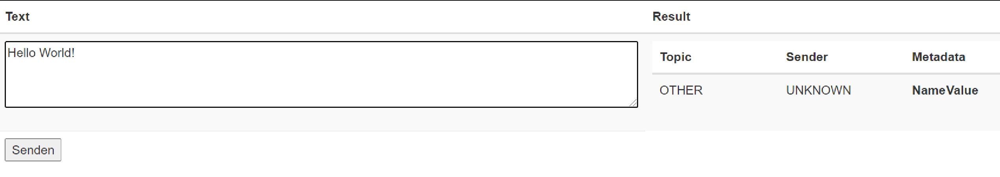

== Components
:toc:

=== Engine
The engine is the core component of this application. It classifies the text and extracts the metadata

==== Using the GUI
You can use the gui exposed at `http://address-of-your-server:port`

You can type in or paste the text to the left-hand textarea, which the engine shall analyze and hit the "Submit"-Button. The result will be presented in the right-hand area

==== Using the REST-API
The engine exposes several methods for analyzing the input text. The most simple one receives the text as a string and returns a `List<SemantikResult>`

The endpoint-path is:
[source, kotlin]
----
"/api/rest/1.0/classifyText"
----

If you want to analyze anything except plain text the method accepts any byte array and uses a combination of `PDFBox` and `Apache Tika` to extract its contents for you.

[source, kotlin]
----
"/api/rest/1.0/classify"
----

TIP: There's also a method for pinging the application. This method simply returns a HTTP/200

[source, kotlin]
----
"/api/rest/1.0/ping"
----

==== How it works
If no text is provided, the engine simply returns an empty result. Otherwise the text is processed in several steps.

===== Text normalization
This step is mandatory for all but metadata. The text is converted to all-lowercase, whitespaces are replaced with a `blank` and characters like "ä" are replaced with "ae"

[source, kotlin]
----
private fun normalizeText(text: String): String {
        return text.toLowerCase()
            .replace(StringConstants.tabstop, StringConstants.blank)
            .replace("\n\r", StringConstants.blank)
            .replace("\r\n", StringConstants.blank)
            .replace(StringConstants.carriageReturn, StringConstants.blank)
            .replace(StringConstants.newLine, StringConstants.blank)
            //		text = text.replace("-", StringConstants.BLANK);
            .replace(",", StringConstants.blank)
            .replace(": ", StringConstants.blank)
            .replace("€", " €")
            .replace("Ü", "ae")
            .replace("ä", "ae")
            .replace("ã¼", "ue")
            .replace("ü", "ue")
            .replace("/", StringConstants.blank)
            .replace("_", StringConstants.blank)
            .replace(RegexConstants.twoBlanksRegex, StringConstants.blank)
            .trim()
    }
----

CAUTION: Text which is parsed to extract the metadata will not be normalized

===== Finding Topics
This step is the most simple one. +
First of all the text is normalized like described above.
Then, it'll be passed through each token for that topic like `NOT` and `OneOf`. The token tries to find its value like "awesome" in the text using the `Levenshtein-distance`. The Levenshtein-distance computes the difference between the text and the tokenvalue itself.

NOTE: "awesome" and "awesome" results in a distance of 0, where "awesome" and "awsome" has a distance of 1, whereas the number represents the number of changes for one string to become equal to the other string

If the distance is less than 2 (so a distance of 0 or 1) it matches. This is done to counter OCR errors

=== Monitor