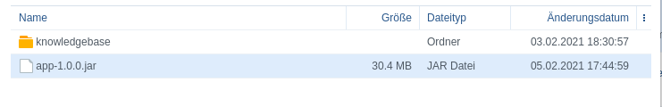
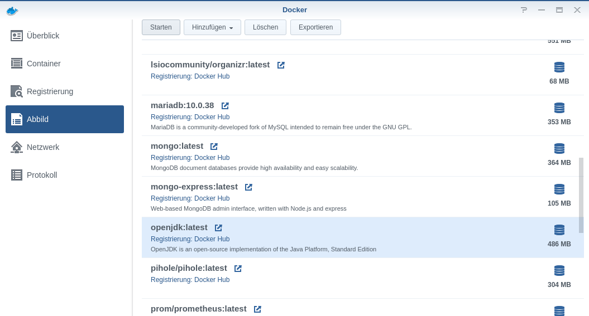
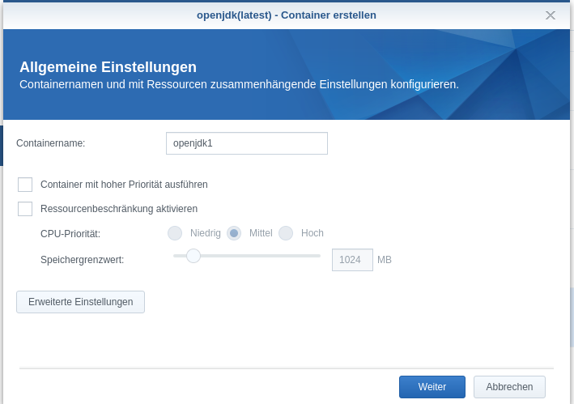
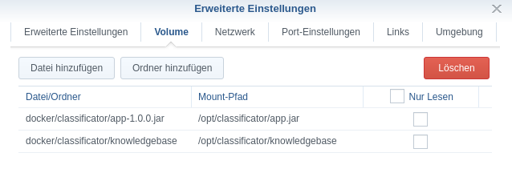
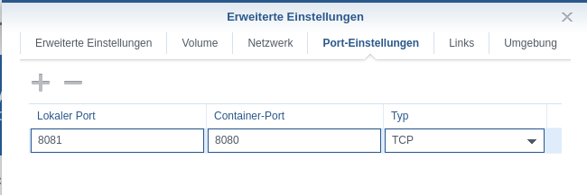

= Classificator
:author:
Simon Thiel (Cuupa)
:toc:
:icons: font

== Installation

=== Required files

You need the following files provided by the release `(example values)`

* The JAR file `(app-1.1.0.jar)`
* The knowlegdebase file `(kb-1.0.2.db)`
* The configuration file `(configuration.yml)`

=== Requirements

This program requires an installed java runtime version 11 or higher

=== Windows/Unix

Since it is a simple .jar file, which can run on any device featuring link:https://www.java.com/de/download/manual.jsp[Java], you can run it by simply doubleclicking.

=== Docker

==== Dockerfile
If you can use a dockerfile, you can create one like this:
Note to self: Need to test this!

[source,dockerfile]
----
FROM openjdk:15-jdk
MAINTAINER Cuupa

WORKDIR /opt/app/classificator

ADD https://github.com/Cuupa/classificator/releases/download/1.1.0/app-1.1.0_Release.jar /.app.jar
ADD https://github.com/Cuupa/classificator/releases/download/1.1.0/kb-1.0.2.db /.knowledgebase/kb-1.0.2.db

COPY knowlegebase/*.db ./knowledgebase/
COPY *.jar ./app.jar

EXPOSE 8080

ENTRYPOINT ["java", "-jar", "./app.jar", "--server.port=8080", "--knowlegde_base=./knowlegebase/kb-1.0.0.db"]
----

Please change the port of the application and change it accordingly.

==== Synology NAS
. Create yourself a folder, where you upload the files to +

. Download the openJDK container +
image:images/open_jdk_download.png[openjdk]

. Create a new container from this image +

. Give this container a name to your likings and click on the 'Advanced Settings' button +

. Mount your folders and files to the docker container. It is also a good idea to change this to "read only" mode, as
this program does not change these files +

. Change the ports to your liking +

. Go to the environment tab and paste this as command to run: +
[source,shell]
----
java -jar /opt/classificator/app.jar '--server.port=8080' '--knowlegde_base=/opt/classificator/knowledgebase'
----

Finally, run this container. You can access the webui by going to `http://your-nas-ip:your-port` For
example `http://192.168.0.3:8081`

== Configuration

:icons: font

This is the default configuration of the application +
It sets the server port to 8080 and the knowledgebase-directory to `build/knowledgebase`

[source,yaml]
----
---
classificator:
  knowledge_base: build/knowledgebase
  api_key_required: true

  admin:
    username: "Jane"
    password: "Doe"

  monitor:
    username: "John"
    password: "Doe"
    enabled: true
    logText: true
    database_name: "monitor.db"
----

=== Server port
The default port of this application is `8080`
So if you want to access the webUI on your local machine navigate to `https://localhost:8080`.If you want to change that port, see <<_via_command_line_arguments, Changing via command line arguments>>

=== Knowledgebase
This entry means, that there has to be a folder named `build/knowlegebase` beside your jar file. You can specify which
knowledgebase to use, by changing it via the command line arguments (How that works will be covered by me
a https://github.com/Cuupa/classificator#Changing-the-configuration[few lines down below]).

TIP: If this entry only contains a folder name without the specific knowlegedbase, it will load the file with the highest version tag in that folder +
For example if you have `kb-1.0.0.db` and `kb-1.0.1.db` it'll load the `kb-1.0.1.db`
[source,yaml]
----
knowlegde_base: build/knowledgebase

----

=== Monitor
The monitor is enabled by default and uses the database `monitor.db`
[source,yaml]
----
 monitor:
    username: "John"
    password: "Doe"
    enabled: true
    logText: true
    database_name: "monitor.db"

----

==== Username and password
These entries set the username and password for accessing the statistics under `/monitor`

==== Database name
The database name is defined via `database_name`. You can change it to your likings. It uses relative paths by default. If you want to use absolute paths, change it to
[source,yaml]
----
database_name: "C:\Users\John Doe\monitor.db"
----
==== Enabled and logText
If `enabled` is set to `true`, all events will be logged. To turn it off, set it to `false`.
If `logText` is enabled, the actual analyzed texts will be logged into the database. You might want to turn it off for privacy reasons, but it really helps finding errors in the classification process.

=== Changing

CAUTION: If you use the command line arguments, the corresponding entry in the configuration.yml will be overwritten

==== Via config
If you want to change the configuration, just edit it with any text editor and change it to your likings
[source,yaml]
----
knowlegde_base: knowledgebase/kb-1.0.0.db
----

or

[source,yaml]
----
monitor:
  logText: false
----

Save the file and restart your application.

NOTE: Changing the config file and restarting the application is the recommended way of changing program parameters.

==== Via command line arguments
You can also use the command line arguments

CAUTION: The server port can only be changed by using the command line arguments

[source,shell]
----
java -jar app.jar '--server_port=8080' '--knowledge_base=knowlegebase/kb-1.0.0.db' '--classificator.monitor.logText=false' '--configuration=/opt/classificator/configuration.yml'
----

NOTE: The first part simply runs the jar by the name "app.jar" +
[source,shell]
----
java -jar app.jar
----

NOTE: This part sets the port to 8080 and overwrites the value of the default configuration
[source,shell]
----
--server_port=8080
----

NOTE: This part sets the location of the knowledgebase. You can use relative paths like
[source,shell]
----
--knowledge_base=knowlegebase/kb-1.0.0.db
----

NOTE: or absolute paths like
[source,shell]
----
--knowledge_base="C:\Users\John Doe\knowlegebase\kb-1.0.0.db"
----
CAUTION: If your parameter contains a whitespace (eg a `blank`) you need to quote the value

[source, shell]
----
--configuration=/opt/classificator/configuration.yml
----
NOTE: Sets the path to the configuration file

== Components
:toc:

:icons: font

=== Engine

The engine is the core component of this application. It classifies the text and extracts the metadata

==== Using the GUI

The GUI is intended to be for regression-testing and to access the monitor and to create API-Keys.

You can use the gui exposed at `http://address-of-your-server:port`

You can type in or paste the text to the left-hand textarea, which the engine shall analyze and hit the "Submit"-Button.The result will be presented in the right-hand area.

image::images/classification_ui.png[]

==== Using the REST-API

The engine exposes a simple endpoint to get the application state and an endpoint for the acutal classifiying.

The endpoints are

[source,kotlin]
----
"/api/rest/v2/status"
----

and

[source,kotlin]
----
"/api/rest/v2/classification"
----

If you want to analyze anything except plain text the method accepts any byte array and uses a combination of `PDFBox` and `Apache Tika` to extract its contents for you.

==== How it works

If no text is provided, the engine simply returns an empty result.
Otherwise the text is processed in several steps.

===== The Knowledgebase

The knowledgebase is just a simple 7z archive, containing descriptions of the topics, the senders, the metadata and regexes.

The topics, senders and metadata may contain any number of following tokens:

* All
* Not
* OneOf
* WildcardBefore

Example of a topic:

[source,text]
----
BILL = {
	oneOf("rechnung","jahresrechnung","Zahlung der","zahlen Sie den Betrag","Rechnungs-Nr","rechnungsbetrag"),
	oneOf("eur, "euro", "€"),
	not("beitragsrechnung"),
	not("dauerauftrag", "quittungsbeleg"),
	not("versicherungsschein", "versicherungs-nr"),
	not("gehaltsabrechnungen"),
	not("rechnung trägt"),
	not("keine Zahlung erhalten"),
	not("jahresdepotauszug")
}
----

Example of a sender:

[source,text]
----
Rundfunk Beitragsservice = {
    oneOf("Deutschlandradio"),
    oneOf("BEITRAGSSERVICE"),
    oneOf("ARD", "ZDF");
}
----

Example of a sender:

[source,text]
----
$IBAN = {
    oneOf("IBAN: [IBAN]", "IBAN [IBAN]")
}
----

NOTE: The value inside the [] brackets is the file name of the regex definition, which shall be injected

Example of a regex:

[source,regexp]
----
[a-z]{2}[0-9]{2}[\s]?[0-9]{4}[\s]?[0-9]{4}[\s]?[0-9]{4}[\s]?[0-9]{4}[\s]?[0-9]{2}
----

CAUTION: The regular expressions are `case insensitive`

===== Text normalization

This step is mandatory for all but metadata.
The text is converted to all-lowercase, whitespaces are replaced with a `blank` and characters like "ä" are replaced with "ae"

[source,kotlin]
----
private fun normalizeText(text: String): String {
        return text.toLowerCase()
            .replace(StringConstants.tabstop, StringConstants.blank)
            .replace("\n\r", StringConstants.blank)
            .replace("\r\n", StringConstants.blank)
            .replace(StringConstants.carriageReturn, StringConstants.blank)
            .replace(StringConstants.newLine, StringConstants.blank)
            //		text = text.replace("-", StringConstants.BLANK);
            .replace(",", StringConstants.blank)
            .replace(": ", StringConstants.blank)
            .replace("€", " €")
            .replace("Ü", "ae")
            .replace("ä", "ae")
            .replace("ã¼", "ue")
            .replace("ü", "ue")
            .replace("/", StringConstants.blank)
            .replace("_", StringConstants.blank)
            .replace(RegexConstants.twoBlanksRegex, StringConstants.blank)
            .trim()
    }
----

CAUTION: Text which is parsed to extract the metadata will not be normalized.

===== Finding Topics

This step is the most simple one. +
First of all the text is normalized like described above.
Then, it'll be passed through each token for that topic like `NOT` and `OneOf`.
The token tries to match its value like "awesome" with the provided text using the `Levenshtein-distance`.
The Levenshtein-distance computes the difference between the text and the tokenvalue itself.

NOTE: "awesome" and "awesome" results in a distance of 0, where "awesome" and "awsome" has a distance of 1, whereas the number represents the number of changes for one string to become equal to the other string

If the distance is less than 2 (so a distance of 0 or 1) it matches.
This is done to counter OCR errors (like mistaking a lowercase-"L" for an uppercase-"i")

===== Finding Senders

Finding senders is a 2 stage process.
In the first stage, the sender defintions inside the knowledgebase are matched against the text which should be analyzed.
If a sender is found: great!

If no sender is found, the text ist processed by the second stage.
The engine tries to match the defintion

[source,text]
----
$sender = {
	oneOf("[SENDER]")
}
----

with the regex

[source,regexp]
----
((?!(Ihre|Handelsregister|Die)))[a-zA-Z0-9]{1}[0-9& a-zA-Zäöü\-]+ (AG|a\.G\.|GmbH|SE|OHG)

----

CAUTION: This regex is only valid for german companies

Being a relatively coarse regex, this will match more words than the actual company name may be. +
To determine the actual sender, the matched regex result is weighted by `number of occurences in the text * number of words matched`

Finally the sender is determined by removing all matches with 5 or more `blanks` and returning the result with the most occurences in the text as the final sender.

===== Finding Metadata
Extracting the metadata is the most costly operation of all recognition, because of the ability to use regex and the need of recompiling the metadata defintions for every call.

Every result then is normalized like inserting spaces in an IBAN.

=== Monitor
The monitor is a statistical tool for getting informations on topic distributions, execution time and a history of processed texts with the recognized results etc.

Currently, theres pie charts for topic and sender distribution, a line chart for execution time and a table with the history.

The table consists of the columns:

* Knowledgebase version
* Received
* Processing Time
* Topics
* Senders
* Metadata
* Analyzed Text
* Download

NOTE: The analyzed text is only persisted if you enabled it via the config file

NOTE: The download column provides a link for saving this specific entry as a `CSV` file in case of reproducing classification errors etc.
